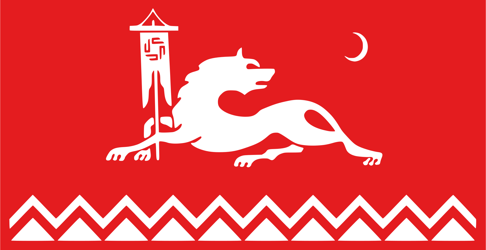

# Awesome Avar (Магӏарул)

  
   
  <strong>🌍 Curated collection of <em>every useful link</em> about the Avar language and Avar people</strong>

> **Avar** refers to both the Avar language (**Магӏарул мацӏ** — “language of the mountains”) and the **Avar people** (Магӏарулал). Spoken by approximately **~1.2 million** people, it is one of the six official literary languages of Dagestan and serves as a lingua franca in many areas of the Caucasus.

## About Avars

- **Native names**: Авар мацӏ • МагӀарулал ва МагӀарул мацӏ  
- **Speakers**: ≈ 1,200,000 (2021 estimate)  
- **Language family**: Northeast Caucasian (Avar–Andic branch)  
- **Official status**: One of the six literary languages of Dagestan and lingua franca in the North Caucasus  
- **Writing system**: Cyrillic (modern); previously Arabic (ajam), Georgian, and Latin (1928–1938)  
- **Geographic distribution**: Mainly Dagestan (Russia), also Azerbaijan, Chechnya, and diaspora communities  
- **UNESCO status**: Vulnerable  
- **ISO codes**: `av` / `ava`

---

## Contents

- [Dictionaries & Lexicons](#dictionaries--lexicons)
  - [Online Dictionaries & Lexicons](#online-dictionaries--lexicons)
  - [Major Printed Dictionaries](#major-printed-dictionaries)
- [Software, Tools and Applications](#software-tools-and-applications)
  - [Translators](#translators)
  - [AI & NLP Resources](#ai--nlp-resources)
  - [Mobile Apps (Android)](#mobile-apps-android)
  - [Keyboard Layouts](#keyboard-layouts)
- [Grammars & Textbooks](#grammars--textbooks)
  - [In English](#in-english)
  - [In Turkish](#in-turkish)
  - [In Georgian](#in-georgian)
  - [In French](#in-french)
  - [In Russian](#in-russian)
- [Videos & YouTube Channels](#videos--youtube-channels)
- [Audio & Pronunciation](#audio--pronunciation)

---

## Dictionaries & Lexicons

### Online Dictionaries & Lexicons

- **[Avar.me (Онлайн Словарь Аварского языка)](https://avar.me/)** — Premier bidirectional **Аварско-русский / Русско-аварский** dictionary based on the Gimbatov dictionary. Full grammatical forms, cases, rich example sentences, and support for Cyrillic + Latin transliteration.  
  - [Dev version](https://dev.avar.me/)  
  - [Telegram Bot](https://t.me/avarme_bot)
- **[Avaro-English Dictionary](https://saidobavar.ru/dictionary)** — Modern, clean **Avar–English** lexical portal with searchable roots and phrases.
- **[IDS CLLD Avar Dictionary](https://ids.clld.org/contributions/107)** — High-quality conceptual vocabulary dataset by **М.Ш. Халилов (Madzhid Khalilov)** — excellent for linguistic research.

### Major Printed Dictionaries

- **Гимбатов М.М. (Gimbatov M.M., ред.)** — *МагӀарул-гӀурус лугъат / Аварско-русский словарь* (≈36,000 entries). Махачкала: ДНЦ РАН, 2006. **Current standard reference** with modern terminology and idioms.
- **ГӀалиханов С.З. (Alikhanov / Galihanov S.Z., ред.)** — *ГӀурус–авар словарь / Русско-аварский словарь* (≈40,000+ entries). Махачкала, 2003.
- **Саидов М.-С. (Saidov M.-S.)** — *Аварско-русский словарь* (≈18,000 words). Moscow, 1967. Includes a short grammatical sketch.
- **Жирков Л.И. (Zhirkov L.I.)** — *Аварско-русский словарь*. ОГИЗ РСФСР, 1936. Foundational early dictionary.

## Software, Tools and Applications

- **[Multidagestan Census — Avar Native Speakers](https://multidagestan.com/census#natives=%22Avarskiy%22)** — Interactive map and detailed 2021 census data showing the geographic distribution and number of Avar (Avarskiy) native speakers across Dagestan and the North Caucasus. Excellent visual resource for language demography.

### Translators

- **[Google Translate (English ↔ Avar)](https://translate.google.com/?sl=en&tl=av&op=translate)** — Best neural machine translation support for Avar (also works with Russian).
- **[Glosbe English–Avaric](https://glosbe.com/en/av)** — Crowdsourced dictionary with thousands of example sentences and context.
- **[Avar Translator (Android)](https://play.google.com/store/apps/details?id=com.bj.translatorrussian)** — Feature-rich mobile translator with voice chat, camera OCR and offline mode.
- **[VocaLingo](https://web.vocalingo.app/)** — AI tool for translation media data while preserving the original speaker's voice. Supports Avar
- **[AvarTranslator](https://github.com/desertfox56/AvarTranslator/)** — Web-based morphological analyzer for Avar. Identifies roots, affixes, and grammatical features of Avar words and phrases.

### AI & NLP Resources

- **[Avar Language Expert](https://github.com/beched/avar-language-expert)** — Curated high-quality corpus and **agentic expert system** for Avar. Contains reference grammars, full Avar Wikipedia dump, Telegram archives, children’s magazines, and a bidirectional SQLite dictionary (~37K entries). Optimized for semantic search, grammar Q&A, and RAG-style AI assistants (Claude, Cursor, etc.).
- **[AvarNLP](https://github.com/Burtinsaw/AvarNLP)** — World’s first machine translation system for Avar, built with **genetic algorithms** to evolve training data from a tiny seed corpus (~1K parallel sentences) and fine-tune NLLB-600M (LoRA). Focuses on Avar–Turkish (with future Avar–Russian support), includes FastAPI/Gradio demo. Pioneering work for extremely low-resource/endangered languages.<grok-card data-id="a08175" data-type="citation_card" data-plain-type="render_inline_citation" ></grok-card>
- **[facebook/mms-tts-ava](https://huggingface.co/facebook/mms-tts-ava)** — High-quality Text-to-Speech model for Avar (`ava`) from Meta’s Massively Multilingual Speech (MMS) project. Uses VITS architecture to generate natural-sounding speech waveforms from Avar text with variable rhythm and expressiveness. Supports inference via Hugging Face Transformers (CC-BY-NC-4.0).<grok-card data-id="61ed85" data-type="citation_card" data-plain-type="render_inline_citation" ></grok-card>
- **[goldfish-models/ava_cyrl_full](https://huggingface.co/goldfish-models/ava_cyrl_full)** — Monolingual Avar (Cyrillic, `ava_cyrl`) GPT-2-style language model (124M parameters) trained on ~30 MB of Avar text data. Part of the Goldfish low-resource language suite; ideal for text generation, research, and downstream NLP tasks in Avar.<grok-card data-id="361252" data-type="citation_card" data-plain-type="render_inline_citation" ></grok-card>
- **[volina092/avarBERT](https://huggingface.co/volina092/avarBERT)** — BERT-style model specialized for the Avar language (82M parameters). Designed for Avar-specific NLP tasks such as embeddings, classification, and masked language modeling.
- **[AvarTranslator](https://github.com/desertfox56/AvarTranslator/)** — Web-based morphological analyzer for Avar. Identifies roots, affixes, and grammatical features of Avar words and phrases.
- **[GlotLID](https://github.com/cisnlp/GlotLID)** — State-of-the-art language identification model supporting **2,000+ languages** (including Avar `ava`). Excellent for detecting Avar text in multilingual Caucasus content or mixed-language datasets (FastText-based, EMNLP 2023).<grok-card data-id="82b255" data-type="citation_card" data-plain-type="render_inline_citation" ></grok-card>

### Mobile Apps (Android)

- **[Аварский Словарь (Prizma)](https://play.google.com/store/apps/details?id=com.apps.learn.easy.avardictionary)** — The most complete offline Avar–Russian dictionary.
- **[Dictionary in Avar language](https://play.google.com/store/apps/details?id=org.slovaravar)** — Lightweight and easy-to-use Avar dictionary.
- **[AvarApp](https://play.google.com/store/apps/details?id=my.exam.avarapp)** — Best all-in-one offline toolkit: multi-language dictionary (RU/EN/TR), phrasebook, grammar tutorial, and library.
- **[Avar Translator](https://play.google.com/store/apps/details?id=com.bj.translatorrussian)** — See [Translators](#translators) for details.
- **[LingvoPlay Avar](https://play.google.com/store/apps/details?id=com.anonymous.linvoPlayAvar)** — Beautiful interactive app for children and adults. Features: animated alphabet with audio, vocabulary builder (numbers, colors, animals), educational games, and creative drawing studio. Excellent for language preservation in Dagestan.

### Keyboard Layouts

- **Gboard** (Android) — Official Avar support added in 2019. Search "Avar" under Languages → Add keyboard. Includes predictive text and voice input.
- **[FUTO Keyboard](https://keyboard.futo.org/)** (Android) — Open-source, privacy-focused keyboard with support for custom layouts including North Caucasian languages.
- **[Avar Keyboard for Windows](https://github.com/borodaagvali/avar-keyboard-windows)** (Windows) — MSI installer adding a full Avar Cyrillic layout under Russian. Palochka via `Alt+Ctrl+Ш`. Works on Windows 7–11.
- **[Аварская клавиатура by SandR](https://apkcombo.com/ru/avar-keyboard/ru.ig.android.avarkeyboard/)** (Android) — Dedicated Avar keyboard APK for focused Avar-only typing.
- **[iOS System Keyboard (demo)](https://agisight.github.io/ios-system-keyboard/)** (iOS/iPadOS) — System-level keyboard with extended Cyrillic support for Avar, works across all apps.

## Grammars & Textbooks

### In English

- **Diana Forker — Avar Grammar Sketch (English)** — Modern, detailed English-language sketch covering phonology, morphology, and syntax of literary Avar. Freely downloadable PDF — currently the best Western academic resource.
- **Cyril Graham (Сирил Грэхем) — The Avar Language (Vocabulary and Grammar), 1873/1881 (English)** — Early English grammar sketch with extensive vocabulary. Modern Russian scientific translation with full text and commentary available via Academia.edu. Historical but valuable primary source.

### In Turkish

- **Avar Dili, Magharul Matz, Avarca** (Şamil Yıldız et al.) — Turkish-language grammar and introductory materials for Avar (Avarca / МагӀарул мацӀ). Includes school-level grammar books such as *Avar dili 3. sınıf dil bilgisi gramer*.
- **Türkçe – Avarca – Rusça Sözlük / Avarca – Türkçe – Rusça Sözlük** (Cafer Barlas, 2001) — Trilingual dictionary useful as a learning companion for Turkish speakers studying Avar.

### In Georgian

- **იმნაიშვილი ი.ვ. (Imnaishvili I.V.)** — *ხუნძურ-ქართული ლექსიკონი (ლინგვისტური კომენტარებით, ინდექსითა და გრამატიკული ნარკვევით)* [Avar–Georgian Dictionary (with linguistic commentaries, index, and grammatical sketch)]. Tbilisi: Metsniereba, 1966. Classic academic reference; includes a grammatical sketch of Avar and a full Georgian index.

### In French

- **Charachidzé, Georges (Шаршидзе Жорж)** — *Grammaire de la langue avar : langue du Caucase nord-est* (French, 1981). One of the most detailed traditional Western grammars; includes parallel texts. Available via academic archives (e.g., Archive.org and Academia.edu).

### In Russian

- **Алексеев М.Е., Атаев Б.М., Магомедов М.А., Магомедов М.И., Мадиева Г.И., Саидова П.А., Самедов Дж.С.** — *Современный аварский язык* [Modern Avar Language]. Махачкала: ИЯЛИ ДНЦ РАН, Изд-во АЛЕФ, 2012 (420 pages). Collective monograph providing the most up-to-date comprehensive analysis of the phonetic system of literary Avar, lexicon, word-formation, grammar, and sociolinguistic features. The current standard reference grammar of modern literary Avar.
- **Бокарев А.А. (Bokarev A.A.)** — *Синтаксис аварского языка* [Syntax of the Avar Language]. Moscow–Leningrad: AN SSSR, 1949. Foundational syntax study, still widely cited in modern research.

## Videos & YouTube Channels

- **[Хунзах ТВ / Khunzakh TV](https://www.youtube.com/@khunzakhtv)** — Leading Avar-language TV channel from Khunzakh (historical capital of the Avar Khanate). Regular news, cultural programs, music, documentaries, and local life in Avar language. One of the richest sources of authentic spoken Avar content
- **[Саид об Аварском](https://www.youtube.com/@AccountSaida)** — YT channel dedicated to promoting and teaching the literary form of the Avar language

## Audio & Pronunciation

- **[KaspLingua.ru](https://kasplingua.ru/%d0%b0%d1%83%d0%b4%d0%b8%d0%be-%d0%ba%d0%bd%d0%b8%d0%b3%d0%b8-%d0%bd%d0%b0-%d1%80%d0%be%d0%b4%d0%bd%d1%8b%d1%85-%d1%8f%d0%b7%d1%8b%d0%ba%d0%b0%d1%85-2018%d0%b3%d0%be%d0%b4/)** — Audio books in multiple caucasian languages including Avar
- **[Avar mp3 Bible](https://www.divinerevelations.info/documents/bible/avar_mp3_bible/avar_institute_for_bible_translation_nt_drama/)** — Audio recordings of the New Testament in Avar, produced by the Institute for Bible Translation

## License

This awesome list is licensed under [CC0 1.0 Universal](https://creativecommons.org/publicdomain/zero/1.0/) — use it freely.

---

> *Made with ❤️ for the Avar language and its speakers in the Caucasus*
